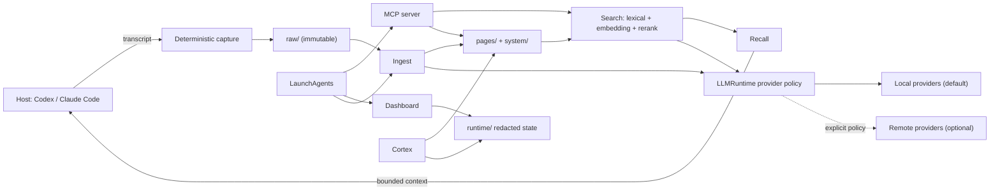

# Chronovisor

**Provenance-first agentic memory for local AI systems.**

LLM agents forget everything between sessions. Chronovisor gives them
durable, searchable, local-first memory — without sending your data to the
cloud.

It captures every conversation automatically, distills knowledge into
structured pages, and recalls the right context when the agent needs it.
All data stays on your filesystem under `~/.chronovisor/`, versioned and
auditable.

## Why Chronovisor

| Problem | Solution |
|---------|----------|
| Agents lose context across sessions | Immutable transcript capture with automatic knowledge extraction |
| Vector-DB memory has no provenance | Every fact traces back to the raw conversation that produced it |
| Cloud memory services leak private data | Everything runs locally — your filesystem, your models, your rules |
| Recall quality degrades silently | Built-in eval, calibration, and distillation pipelines to measure and improve |

## Features

- **MCP server** — standard [Model Context Protocol](https://modelcontextprotocol.io/) interface for any MCP-capable host
- **Host hooks** — automatic transcript capture for Claude Code, Codex, and custom hosts
- **Hybrid search** — lexical + local embedding + reranking, no external API calls
- **Recall orchestration** — decides what context is safe and useful to inject, with bounded token budgets
- **Knowledge distillation** — local teacher models label recall quality; the system learns from its own decisions
- **Decision quorum** — structured mutations use a primary/challenger vote with fail-closed tie-breaking
- **Research engine** — multi-source evidence gathering with provenance tracking
- **Dashboard** — loopback-only operations view with optional authenticated LAN mode
- **Self-healing** — integrity checks, automatic repair, and operational runbooks

## Quick start

Prerequisites: standard CPython 3.14, [uv](https://docs.astral.sh/uv/), and
[Ollama](https://ollama.com/) for local model inference.

```sh
git clone https://github.com/trafficsign/chronovisor.git
cd chronovisor
uv sync --frozen

# Create the data root
install -d -m 700 ~/.chronovisor
test ! -e ~/.chronovisor/config.toml
install -m 600 config.toml.example ~/.chronovisor/config.toml

# Pull the default local models
ollama pull gpt-oss:20b       # generation
ollama pull bge-m3             # embedding
ollama pull ornith:9b-q4_K_M  # reranking
```

The example configuration is the smallest supported local-only setup with no
external network egress. Existing `~/.chronovisor/config.toml` files should
be merged manually rather than overwritten.

Start the MCP server:

```sh
uv run chronovisor-mcp
```

Verify the installation:

```sh
uv run chronovisor doctor
```

Optional: start the dashboard on loopback:

```sh
uv run chronovisor-dashboard --host 127.0.0.1 --port 8765
```

Host hook installation is optional. Review [the hook guide](docs/hooks.md)
before allowing the installer to update Codex or Claude Code settings.

### Teacher models for distillation

Chronovisor can distill recall quality using a local teacher fleet. The
canonical teacher models are custom MLX quantizations:

- `qwen3.8:27b-axq4` — AXQ 4-bit (17 GB)
- `muse-glimmer:30b-q4k-dynamic` — dynamic Q4_K (21 GB)
- `gemma4:26b-optiq4` — OptiQ mixed-bit (21 GB)

These are Hugging Face MLX imports, not Ollama registry pulls. See
[operations](docs/operations.md) for exact revisions and runtime
requirements.

## Architecture



**Capture** is deterministic and never calls an LLM — transcripts are stored
immutably in `raw/`. **Ingest** turns raw captures into structured pages.
**Search** combines lexical retrieval with optional local embedding and
reranking. **Recall** decides what context is safe and useful to inject.

The **LLMRuntime** layer normalizes generation, embedding, reranking, and
classification across providers. Local providers are the default; remote
egress is explicitly configured and policy-gated.

See [architecture](docs/architecture.md),
[configuration](docs/config.md), [operations](docs/operations.md), and the
[threat model](docs/threat-model.md) for details.

## Data layout and security boundary

The default data root is `~/.chronovisor/`; override with `CHRONOVISOR_ROOT`.

| Directory | Purpose |
|-----------|---------|
| `config.toml` | Runtime policy and model selection (mode `0600`) |
| `raw/` | Immutable transcript captures |
| `pages/` | Long-term knowledge pages |
| `system/` | Privileged profile and state documents |
| `recall/` | Recall decisions, feedback, and field state |
| `runtime/` | Locks, queues, receipts, health, redacted traces |
| `research/` | Evidence and review artifacts |
| `claims/` | Derived claim indexes |

Chronovisor's security boundary is the local OS user, the data root,
loopback services, configured model endpoints, and explicitly enabled
network egress. It does not defend against processes running as the same
user or root. Keep the dashboard on loopback. Enable LAN access only as
documented in [operations](docs/operations.md). Never store plaintext
credentials in the repository, config, arguments, or logs.

## Project status

Chronovisor is pre-release software (v0.2.0). The primary supported
deployment is local-only. Cloud and hybrid routing modes are experimental.

The codebase is actively developed with 240,000+ lines of Python, 5,000+
tests, and enforced quality gates (ruff, mypy, import-linter).

Report vulnerabilities privately as described in [SECURITY.md](SECURITY.md).

## Contributing

```sh
uv sync --frozen
uv run ruff check --no-cache src scripts tests
uv run mypy
uv run lint-imports --no-cache
CHRONOVISOR_ROOT="$(mktemp -d)" uv run pytest -q
```

Keep tests isolated from a live `~/.chronovisor/` tree. Small changes may
start with focused tests, but the full checks above are the contribution
baseline.
