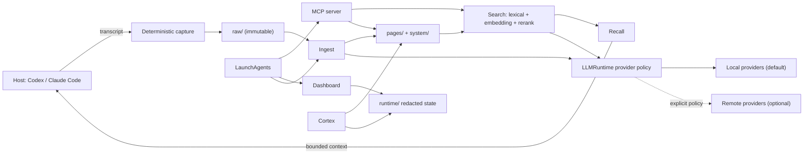

# Chronovisor

Chronovisor is a local-first memory runtime for LLM agents. It stores durable
conversation knowledge on the user's filesystem, exposes it through MCP, and
can connect host hooks for automatic recall and lossless transcript capture.

## Release status

Chronovisor is pre-release software. The only production-supported deployment
is local-only. Cloud-only and hybrid routing are experimental and are not
feature-complete.

Campaign W is complete. Campaign X, the one-shot OKF v0.2 canonical data
migration, remains open until the live migration and rollback drill finish.

Do not treat the current `main` branch as an OSS v1 release.

## Clean local install

Prerequisites are Python 3.11 or newer and [uv](https://docs.astral.sh/uv/).
Ollama is needed only when the local model roles in the example configuration
are enabled.

```sh
git clone https://github.com/trafficsign/chronovisor.git
cd chronovisor
uv sync --frozen
install -d -m 700 ~/.chronovisor
test ! -e ~/.chronovisor/config.toml
install -m 600 config.toml.example ~/.chronovisor/config.toml
```

The example is the smallest supported local-only configuration. It disables
optional Web egress. Existing `~/.chronovisor/config.toml` files should be
merged manually rather than overwritten.

Install the local models named by the example:

`qwen3.8:27b-nvfp4` requires Ollama 0.32.12 or newer.

```sh
ollama pull qwen3.8:27b-nvfp4
ollama pull muse-glimmer:30b-nvfp4-dflash
ollama pull gpt-oss:20b
ollama pull gemma4:26b
ollama pull bge-m3
ollama pull ornith:9b-q4_K_M
```

Start the MCP server from the checkout:

```sh
uv run chronovisor-mcp
```

The MCP server and host hook create the initial data directories on first use.
In another terminal, check the installation or start the loopback-only
Dashboard:

```sh
uv run chronovisor doctor
uv run chronovisor-dashboard --host 127.0.0.1 --port 8765
```

Host hook installation is optional. Review [the hook guide](docs/hooks.md)
before allowing the installer to update Codex or Claude Code settings.

## Architecture and runtime roles



- `chronovisor-mcp` serves the public memory tools.
- `chronovisor-hook` dispatches host events. Capture is deterministic and does
  not call an LLM.
- Hermes Stop events use the dedicated `chronovisor-hermes-record` reader for
  profile-local `state.db` files. Raw IDs and metadata retain `hermes`
  provenance; no Codex or Claude transcript emulation is used.
- Ingest turns immutable raw captures into reviewed pages.
- Search combines lexical retrieval with optional local embedding and rerank
  services. Recall decides what context is safe and useful to inject.
- Structured mutation decisions use a local primary/challenger quorum and a
  tie-break model only when needed; invalid or unresolved decisions fail
  closed.
- The Dashboard is an operations view. Its default service accepts only
  loopback clients. A separate, explicit LAN service is available only with a
  private-IP bind, TLS, authentication, and strict browser origin checks.

The common `LLMRuntime` foundation normalizes generation, embedding, reranking,
source classification, and egress decisions. Production model callers use this
policy boundary; local providers are the default and remote egress remains
explicitly configured and policy-gated.

See [architecture](docs/architecture.md),
[configuration](docs/config.md), [operations](docs/operations.md), and the
[threat model](docs/threat-model.md) for details.

## Data and security boundary

The default data root is `~/.chronovisor`; `CHRONOVISOR_ROOT` selects a different
root for an isolated process. Important locations are:

- `config.toml`: runtime policy and model selection; keep it mode `0600`.
- `raw/`: immutable transcript captures.
- `pages/`: ordinary long-term knowledge.
- `system/`: privileged profile and state documents.
- `recall/`: recall decisions, feedback, and field state.
- `runtime/`: locks, queues, receipts, health, and redacted traces.
- `research/`, `review/`, and `claims/`: evidence, review artifacts, and derived
  claim indexes when those features are used.

Campaign X is still migrating legacy root metadata into the final canonical
layout. Back up the complete data root before testing migration work.

Chronovisor's security boundary is the local OS user, the data root, loopback
services, configured model endpoints, and explicitly enabled network egress.
It does not defend secrets or memory content from arbitrary code running as the
same user, root, or a process-memory compromise. Keep the default Dashboard on
loopback. Enable the separate LAN service only as documented in
[operations](docs/operations.md); never store plaintext credentials in the
repository, config, arguments, or logs.

Report vulnerabilities privately as described in [SECURITY.md](SECURITY.md).

## Contributing and tests

```sh
uv sync --frozen
uv run ruff check --no-cache src scripts tests
uv run mypy
uv run lint-imports --no-cache
CHRONOVISOR_ROOT="$(mktemp -d)" uv run pytest -q
```

Keep tests isolated from a live `~/.chronovisor` tree. Small changes may start
with focused tests, but the full checks above are the contribution baseline.
